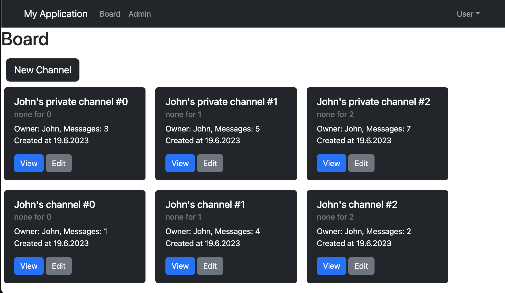
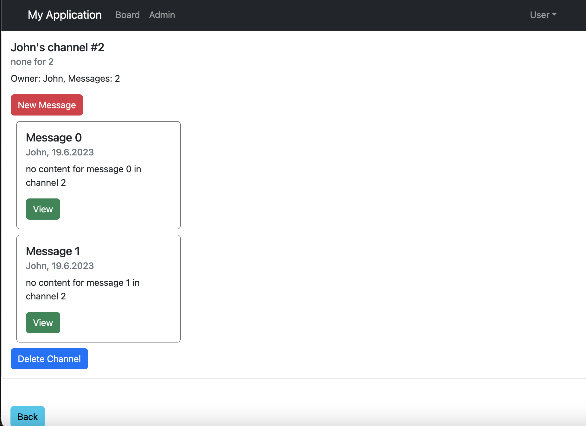

# React Web App

This repository contains a React web application that implements a messaging system with boards and channels.

# Features

- Boards: Users can create boards to organize their messages.
- Channels: Within each board, users can create multiple channels to categorize their messages.
- Messages: Users can send and receive messages within each channel.

# Installation
1. Fork the project under your Github account.
2. Clone your fork
3. Run `npm install`

The tests must be executable via `npm test`.

# Server
You can start projekt either via VSCode or more simply via the command line with `npm start`.

# Getting Started with Create React App

This project was bootstrapped with [Create React App](https://github.com/facebook/create-react-app).

## Available Scripts

In the project directory, you can run:

### `npm start`

Runs the app in the development mode.\
Open [http://localhost:3000](http://localhost:3000) to view it in the browser.

The page will reload if you make edits.\
You will also see any lint errors in the console.

### `npm test`

Launches the test runner in the interactive watch mode.\
See the section about [running tests](https://facebook.github.io/create-react-app/docs/running-tests) for more information.

### `npm run build`

Builds the app for production to the `build` folder.\
It correctly bundles React in production mode and optimizes the build for the best performance.

The build is minified and the filenames include the hashes.\
Your app is ready to be deployed!

See the section about [deployment](https://facebook.github.io/create-react-app/docs/deployment) for more information.

